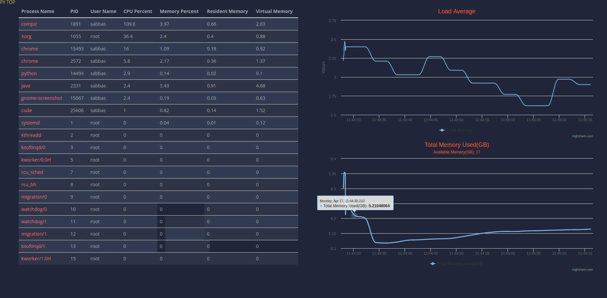

# python-nchan
A simple systems monitoring dashboard which displays process information in realtime similar to what you would see when you run the unix top or htop commands. The app uses Nginx-Nchan as a pub / sub  messaging broker and react as the front end javascript client.

